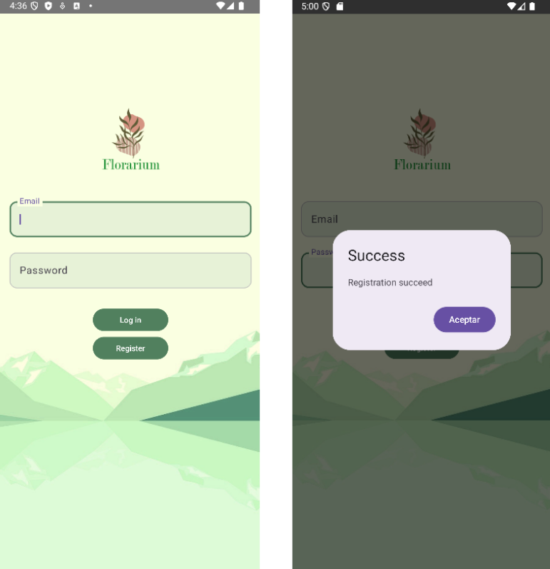
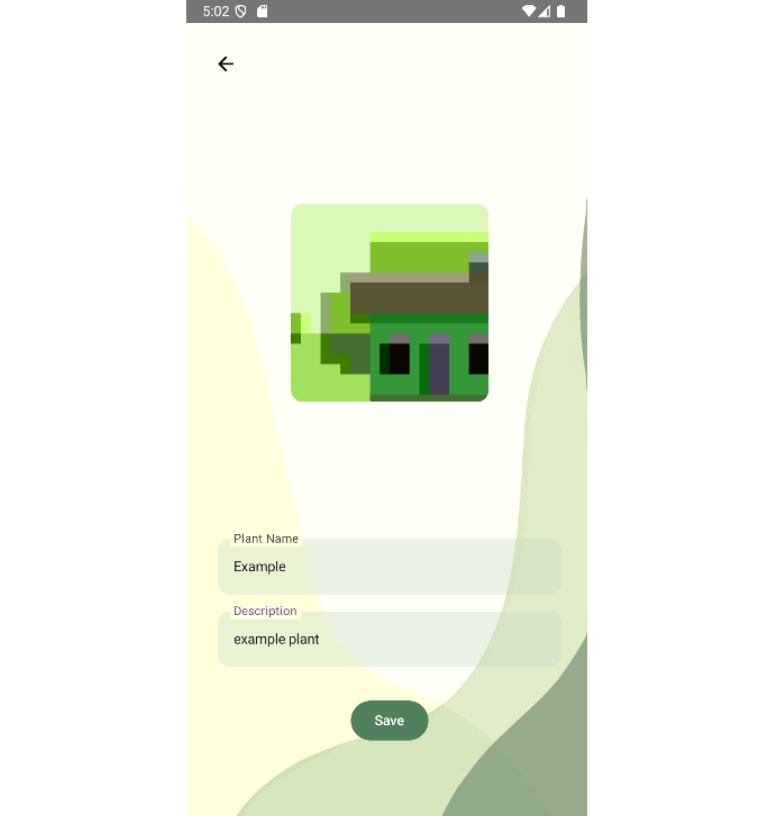

# Florarium

Android Application in Kotlin, using MVVM architecture pattern

Florarium is a plant album app where you can take pictures of plants, and save them with a name and a description.

After saving them in the app, you can export them into your phone.

Future improvements:
  - AI functionality to recognize a plant based on the picture
  - Improve security
  - Be able to login using Google Account
  - Social functionality, to share your plants

## Screenshots

Login and Register Screen

Main Screen, and Plant details Screen

Adding new plant Screen (camera opens to take picture, and then name and description are added)

